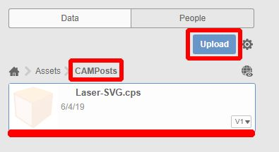
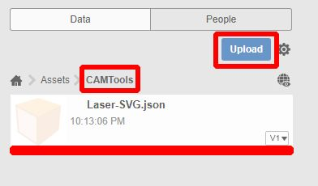
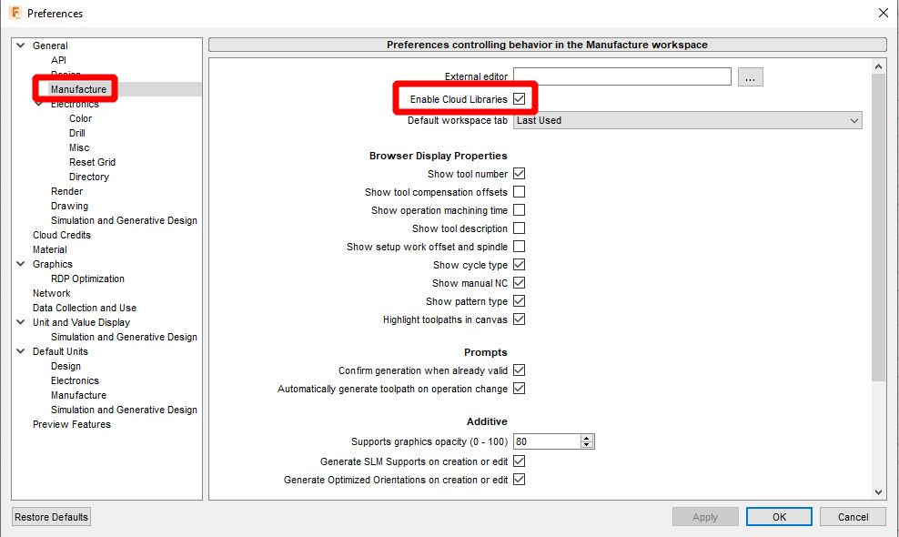

# ⚙️ Fusion 360 - SVG postprocessor

Project page for SVG postprocessor for [Fusion 360](https://www.autodesk.cz/products/fusion-360/) CAM that generates SVG files for laser cutting.

Postprocessor supports laser-width compensation and cutting and engraving modes by using different laser tools.

🔗 Based on [Glowforge post-processor](https://github.com/garethky/glowforge-colorific-fusion360-post) by Glowforge.

## Installation

1. Download the file <a href="./Fusion360-SVG-CAMPost.cps" download>Fusion360-SVG-CAMPost.cps</a> and upload it to Fusion 360 `Assets/CAMPost` folder using the upload button.
It will add a custom postprocessor to Fusion 360. You will find them in `Select Tool` in `Cloud` section.
> 
1. Download the file <a href="./Fusion360-SVG-CAMTools.json" download>Fusion360-SVG-CAMTools.json</a> and upload it to Fusion 360 `Assets/Tools` folder using the upload button.
It will add to Fusion default tools for cutting and engraving.
> 
1. Go to Fusion 360 `Preferences/CAMTools` and click to `Enable Cloud Libraries`.
> 