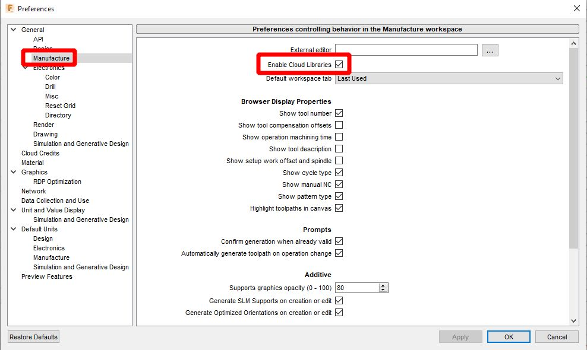

# ⚙️ Fusion 360 - SVG postprocessor

Project page for SVG postprocessor for Fusion 360 CAM that generates SVG files for laser cutting.

Postprocessor supports laser-width compensation and cutting and engraving modes by using different laser tools.

🔗 Based on [Glowforge post-processor](https://github.com/garethky/glowforge-colorific-fusion360-post) by Glowforge.

## Installation

1. Download the file <a href="./Fusion360-SVG-postprocessor.cps" download>Fusion360-SVG-postprocessor.cps</a> and upload it to Fusion 360 `Assets/Post Processors` folder using the upload button.
> 
2. Download the file <a href="./Fusion360-SVG-tools.json" download>Fusion360-SVG-tools.json</a> and upload it to Fusion 360 `Assets/Tools` folder using the upload button.
> 
1. Go to Fusion 360 `Preferences/Manufacture` and click to `Enable Cloud Libraries`.
> 